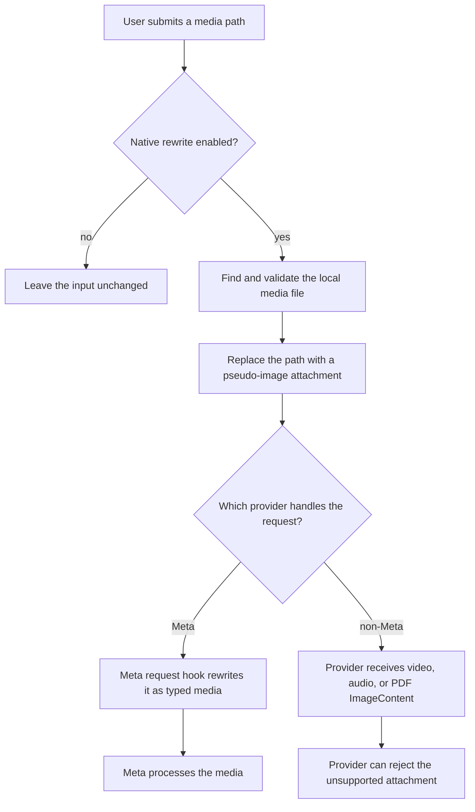
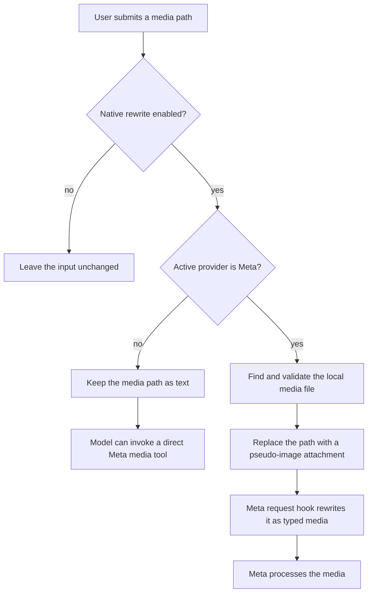
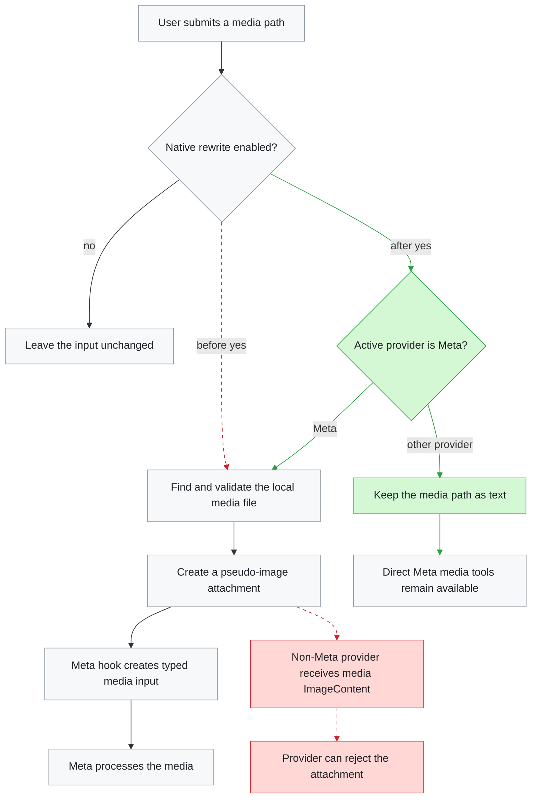

# v0.4.2 media routing — before and after

- **Scope:** `v0.4.1..v0.4.2`
- **Files:** `extensions/media.ts`, `tests/media.test.ts`, `package.json`

Version 0.4.2 prevents media paths such as `@clip.mp4` from being converted into pseudo-image attachments when a non-Meta provider is active. Meta requests keep the native attachment flow, while other providers keep the path as text so the model can call the direct Meta media tools instead of receiving an unsupported `ImageContent` value.

| File | What changed | Why it matters |
| --- | --- | --- |
| `extensions/media.ts` | Added an active-provider guard to the input handler | Only Meta receives pseudo-image attachments that its request hook can rewrite |
| `tests/media.test.ts` | Added provider-routing regression coverage | Confirms Codex is left unchanged while Meta still receives a video attachment |
| `package.json` | Bumped `0.4.1` to `0.4.2` | Published the fix as a patch release |

## Before

The input handler transformed matching media paths for every active provider. Meta could rewrite the pseudo-image into a typed media block, but providers such as Codex could reject the `video/mp4` image before a direct Meta tool could be invoked.

## After

The handler now checks the active provider before reading or transforming the file. Non-Meta inputs remain text, preserving the direct-tool path; Meta inputs continue through the existing native rewrite flow.

## What changed

**Legend** — 🟩 added · 🟥 removed · 🟨 modified · ⬜ unchanged. Dotted red edges are paths that no longer exist.

## Regression coverage

The new test registers the extension with a lightweight `ExtensionAPI` stub, captures the `input` event handler, and creates a temporary `.mp4` file. It verifies both sides of the routing decision:

- With provider `openai-codex`, the handler returns `undefined`, so Pi leaves the original text and path untouched.
- With provider `meta`, the handler returns a `transform` action containing a `video/mp4` pseudo-image, preserving the existing Meta rewrite behavior.

## Operational impact

- No Meta media capability was removed or moved.
- The direct Meta video, audio, and file tools are unchanged.
- File matching, size limits, upload behavior, and typed payload rewriting are unchanged.
- The fix is limited to deciding whether the native input transformation should run for the active provider.
